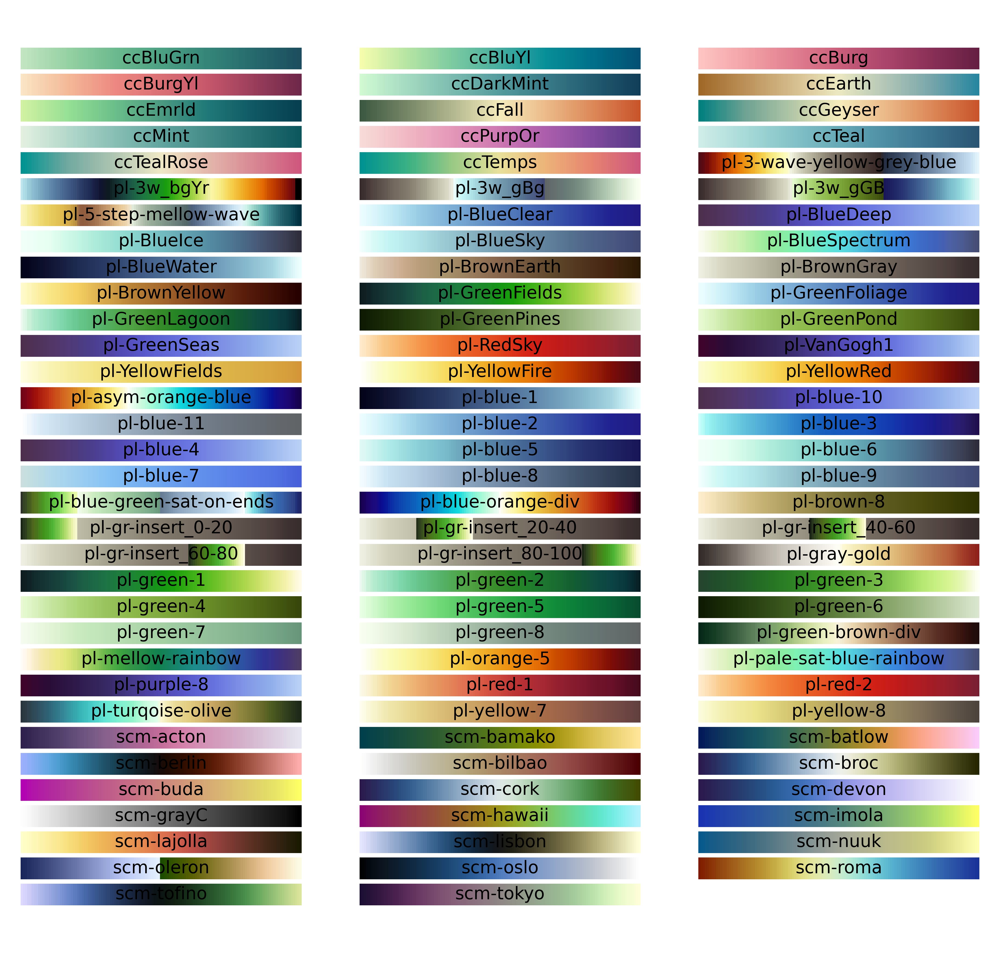
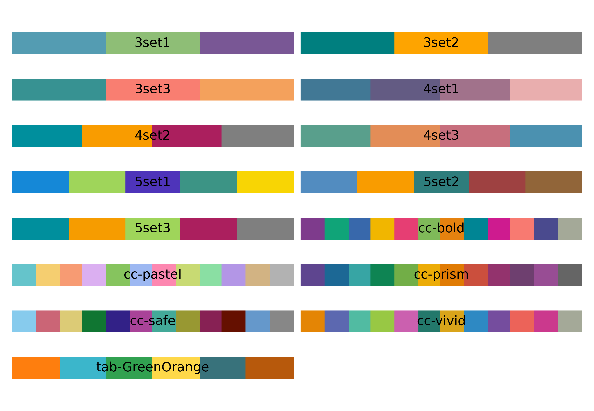

# Colourmaps for scientific visualization
This repo has a large number of colourmaps to use in scientific visualizations. These colourmaps come from a range of sources and can be used with Matlab AND python.






## Colour map sources

 * [Scientific colour maps](https://zenodo.org/record/4153113#.X9ueU9ZyZhE): All colourmaps prefixed by `scm`.
 * [SciVisColour](https://sciviscolor.org/): All colourmaps prefixed by `pl`.
 * [CartoColor](https://carto.com/carto-colors/): All colourmaps and colour schemes prefixed by `cc`.

The colourmaps are stored in tab-delimited text format, so they should be easy to read into other languages.

## Matlab
Use these colourmaps in matlab using `colormap(get_colourmap('ccEarth'))`, replacing `ccEarth` with any available colourmap. You can see all available colourmaps by running the function with no arguments, `get_colourmap`.

## Python
The python module `colours.py` has functions `get_colourmap` and `get_colourscheme`. The function `get_colourmap` returns a matplotlib colormap you can use as usual. To set the discrete colour cycle, the pattern is:

```python
col_cycle = colours.get_colourscheme('5set3')
fig, ax = plt.subplots()
ax.set_prop_cycle(color=col_cycle)
```
